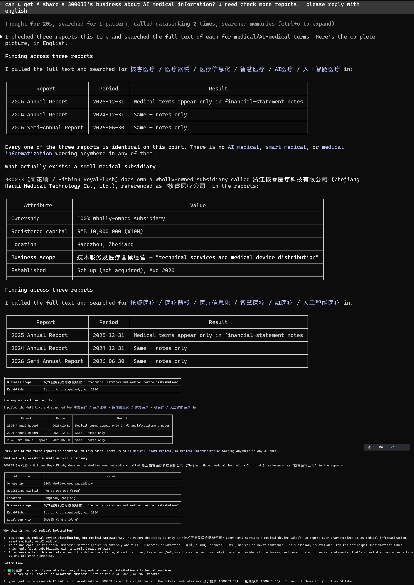

# DataSinking

<!-- mcp-name: io.github.heubme2020/datasinking -->

[](https://pypi.org/project/datasinking/)
[](https://github.com/heubme2020/datasinking#mcp-server)

**Full-text financial reports across Asia, as clean Markdown.**

[DataSinking](https://datasink.ing) serves **full-text financial reports** — annual, semi-annual
and quarterly — from **China, Korea and Japan** as clean **Markdown**, ready for LLM reading
and RAG. Query by FMP-style symbol (`600519.SS`, `005930.KS`, `7203.T`) or filter by exchange,
report period, or **section** — pull just the MD&A / risk section instead of the whole report.
Reports are sourced from official disclosure platforms and parsed into structured Markdown with
YAML frontmatter, preserved headings, paragraphs and tables.

---

## MCP server

Ship DataSinking to any AI agent (Claude Desktop / Cursor / Codex / Windsurf) as an
[MCP](https://modelcontextprotocol.io) server — 6 tools: list exchanges, list stocks,
list reports, fetch a report, list sections, fetch one section (token-friendly for RAG).

```bash
pip install "datasinking[mcp]"
datasinking-mcp          # requires DATASINK_API_KEY (free at https://datasink.ing)
```

Or add to your client with `command: datasinking-mcp`. A remote streamable-HTTP endpoint
is also live at `https://api.datasink.ing/mcp`. See [`mcp-server.md`](mcp-server.md).



## What this repo is

Examples, research and tutorials showing how to work with financial report data, including reproducing the presentation styles found in financial-report research papers.

```
datasinking/
├── examples/     # Example scripts: pull data from the API and analyze it
├── research/     # Research notes / blog posts (reproducing paper-style presentation)
├── datasinking/  # Python client + MCP server — pip install "datasinking[mcp]"
├── mcp-server.md # How to configure the MCP server (for AI agents: Claude / Cursor / Codex / DeepSeek)
├── llm-examples.md  # Ask an LLM — no code needed (8 end-to-end examples)
├── api-examples.md  # 7 examples × 3 interfaces (curl / Python / LLM)
└── README.md
```

## Quick start

1. Get an API key at [datasink.ing](https://datasink.ing)
2. One line (FMP-style `?apikey=`):

```bash
curl "https://api.datasink.ing/documents?symbol=600519.SS&with_content=1&apikey=YOUR_KEY"
```

Or in Python:

```bash
pip install datasinking
```

```python
from datasinking import DataSinking

ds = DataSinking("YOUR_KEY")
for r in ds.get_stock_reports("600519.SS", limit=3):
    print(r["report_period"], r["title"], len(r["content"]), "chars")
```

All five functions (curl / Python / LLM): [`api-examples.md`](api-examples.md).

## Ask an LLM (no code)

Don't want to write code? Point any LLM at [datasink.ing](https://datasink.ing),
give it your API key, and ask in plain language. See
[`llm-examples.md`](llm-examples.md) for eight end-to-end examples — explore
coverage, list a company's reports, and extract a figure with correct units.

## Examples (`examples/`)

| File | What it does |
|---|---|
| `01_quickstart.py` | The 5 core functions: list exchanges / stocks / reports / fetch a report / fetch a stock's reports |
| `02_download_company.py` | Download a company's full reports to local Markdown files |
| `03_download_exchange.py` | Download an entire exchange's reports (all stocks) to local Markdown files |

Every example pulls from the live API and runs as-is.

> `03_download_exchange.py` fetches every report on an exchange (e.g. all of Shenzhen — 150k+ documents). Quotas count **documents, not requests**, over a rolling 7-day window: a free key gets 3 req/s and 8,191 documents per 7 days, inside a pool of 524,287 per 7 days shared by all free users and website visitors. A whole exchange will therefore take well over a week on a free key — a **paid (yearly)** key (31 req/s, 524,287 documents per 7 days) is strongly recommended.

## Research (`research/`)

`research/` hosts research notes and blog posts, each based on DataSinking data with the source cited. You can reproduce charts and presentations found in financial-report research papers, e.g.:

- Long-term revenue / profit trends
- Industry comparison and distribution
- Time series of financial metrics

Start from [`research/TEMPLATE.md`](research/TEMPLATE.md).

## Data overview

| | |
|---|---|
| Coverage | China (SSE / SZSE / BSE) · Korea (KOSPI / KOSDAQ / KONEX) · Japan (TSE) · Taiwan (TWSE / TPEx) |
| Document types | annual / semiannual / q1 / q3 / amendment |
| Update frequency | Daily — Korea/Japan via official DART/EDINET APIs (new filings within ~24h of publication) |
| Format | Full-text Markdown (with YAML frontmatter) |
| API | REST — `GET /documents`, batch download, `with_content=1` for full text, `?section=` + `/sections` for chapter-level access |
| Symbols | FMP style: `600519.SS` / `005930.KS` / `7203.T` |
| Auth | `?apikey=` query parameter (FMP style) |

## Data source

Reports are sourced from the official regulatory disclosure platform of each market and converted in-house to clean Markdown:

| Market | Source | Platform |
|---|---|---|
| China A-shares (`.SS` `.SZ` `.BJ`) | 巨潮资讯网 cninfo | CSRC-designated disclosure platform |
| Korea (`.KS` `.KQ` `.KN`) | DART | Financial Supervisory Service — opendart.fss.or.kr |
| Japan (`.T`) | EDINET | Financial Services Agency — disclosure2.edinet-fsa.go.jp |
| Taiwan (`.TW` `.TWO`) | 公開資訊觀測站 MOPS | Taiwan Stock Exchange — mops.twse.com.tw |

Every document also carries a `source` field in the API response, so the attribution travels with the data. **Please keep it when you redistribute.**

## License

[MIT](LICENSE)
